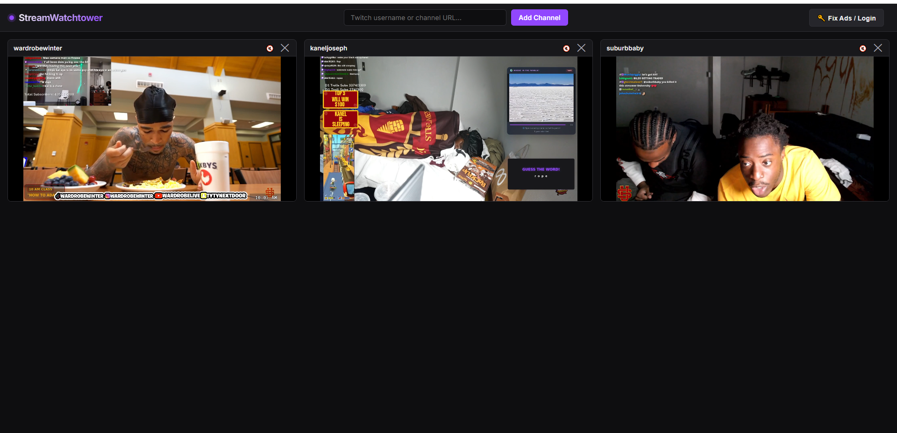

# StreamWatchtower

A clean, premium, client-side multi-stream viewer for Twitch with grid and focus modes. 



## Background
I decided to create this project because Kai Cenat launched **Streamer University** and there are many streamers I want to watch simultaneously. Since Twitch itself doesn't provide a native multi-stream viewing feature, StreamWatchtower was built to solve this problem!

## Features
- **Grid Mode:** Dynamic CSS Grid layout that displays all streams in an adaptive 16:9 aspect-ratio grid.
- **Focus Mode:** Focus on a single stream with a sidebar loaded with Twitch Chat, while keeping the other streams playing in a mini-carousel at the bottom.
- **Collapsible Chat:** Collapsible chat sidebar inside Focus Mode for a cleaner, theater-like viewing experience.
- **Persistent State:** Saves the active stream list in the URL query parameters (e.g. `?channels=shroud,ninja`) and browser `localStorage`.
- **Bilateral Mute Control:** Synchronized custom audio toggle button and player controls. Turning sound on for one player automatically silences the others.
- **Offline Indicators:** Beautiful red badges automatically overlaying offline streams.
- **Keyboard Shortcuts:** `Esc` exits Focus Mode, digits `1-9` quickly switch focus between streams.
- **Fully Client-Side:** No database, server, or backend required. Can be run locally or hosted directly on static providers like GitHub Pages.

## Local Setup (How to run on your PC)

Since browsers restrict modern JavaScript from loading directly from local files (`file:///...`), you must run a simple local web server to use StreamWatchtower. Here is how to do it step-by-step:

### Step 1: Download the Project
Download the project files as a ZIP archive and unpack them into a folder on your computer (e.g. on your Desktop).

### Step 2: Open the Command Console in the Project Folder

#### 🪟 For Windows Users:
1. Open the folder containing the project files (where `index.html` is located) in your standard **File Explorer**.
2. Click on the **Address Bar** at the top of the File Explorer window (which displays the path to the folder).
3. Delete the path text, type exactly **`cmd`**, and press **Enter**.
4. A black Command Prompt console window will open, automatically pointing to your project folder!

#### 🍏 For macOS / Linux Users:
1. Open the **Terminal** app (on macOS, press `Cmd + Space` to open Spotlight, type `Terminal`, and press Enter).
2. Type `cd ` (with a trailing space).
3. Drag and drop the project folder from Finder directly into the Terminal window (this will automatically insert its path), then press **Enter**.

### Step 3: Run the Web Server Command

Type one of the following commands in the console and press **Enter**:

- **Command (Recommended):**
  ```bash
  python -m http.server 8000
  ```
- **If the command above fails, try:**
  ```bash
  python3 -m http.server 8000
  ```
- *Note:* If you get an error saying Python is not recognized, download and install the latest version from [python.org](https://www.python.org/downloads/). During the Windows installation process, make sure to check the box **"Add Python to PATH"**!

### Step 4: Open in Browser
Once the server is running, open your web browser and go to:
[http://localhost:8000](http://localhost:8000)

*(To stop the server at any time, go back to the console window and press `Ctrl + C`.)*

## URL Sharing & Link Format
You can copy your browser URL to save your current setup or share the configuration. You can also directly construct watchtower sessions by appending the `channels` parameter:
```
http://localhost:8000/?channels=shroud,xqcow,ninja
```

> [!IMPORTANT]
> **Sharing with friends:** Because you are running the project on `localhost`, sending a link like `http://localhost:8000/...` to a friend **will not open on their computer** (since `localhost` refers to their own local machine, not yours).
>
> If you want a friend to open your shared link, they must download the project files on their computer, start their own local server using the steps in **Local Setup**, and then open the link in their browser!

## ⚠️ Important Warnings & Twitch Embed Limits
- **Twitch 3-Stream Embed Limit:** Twitch limits third-party embedded streams. It is highly recommended to **not add more than 3 streams** at a time.
- **"Commercial break in progress" & Ads:** Twitch serves a permanent "Commercial break in progress" screen to third-party embeds if multiple streams are running at the same time. Sometimes, logging in inside the player's chat iframe does not help because browsers block third-party cookies by default (which isolates the embed session). Even after logging in, Twitch may still throw streams into ad screens after a few minutes.
  - **Workaround:** Add `[*.]twitch.tv` to your browser's "Allowed to use third-party cookies" exception list (Chrome settings -> Privacy and security -> Third-party cookies) and sign in inside the Chat embed to share your Twitch Turbo or subscribed account credentials.

## Contributing
Contributions are welcome! Feel free to open issues or submit pull requests. For major changes, please open an issue first to discuss what you would like to change.

## License
MIT [LICENSE](LICENSE) © 2026 Koval09
